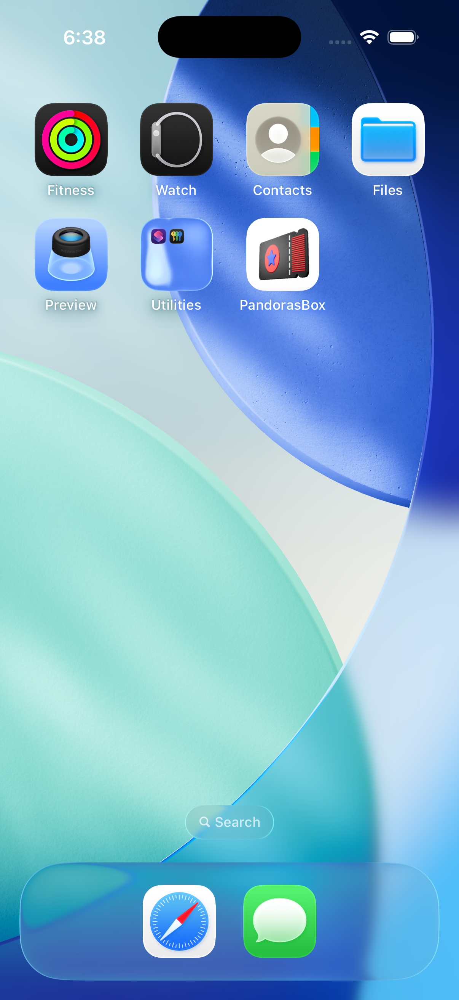
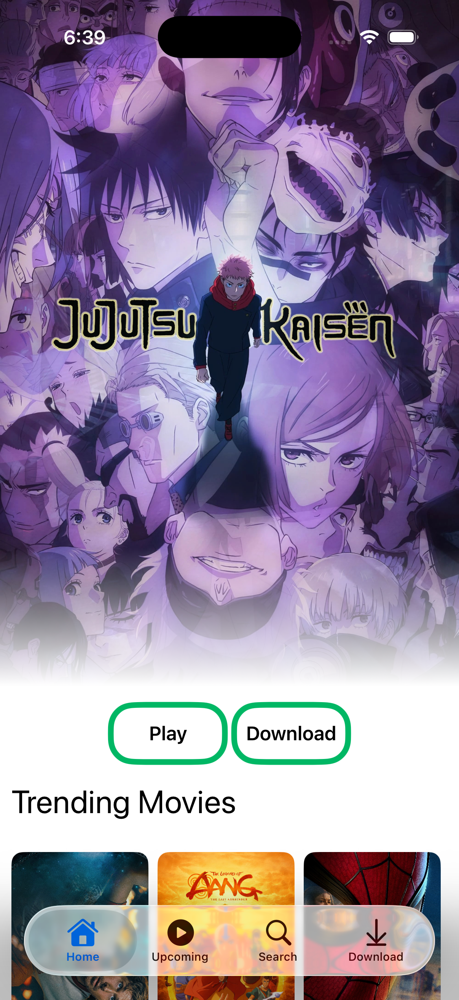
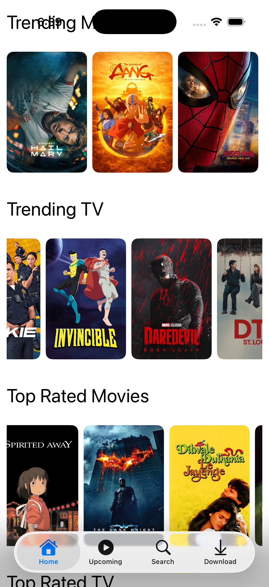
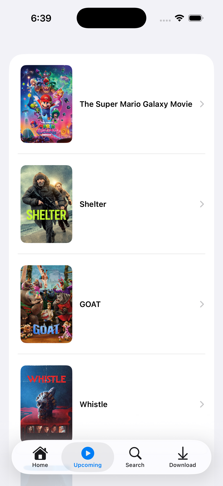
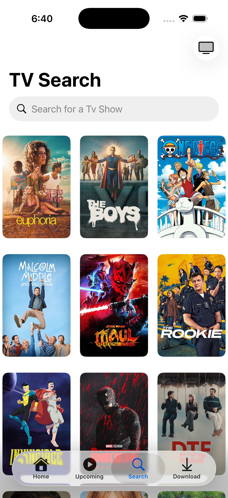
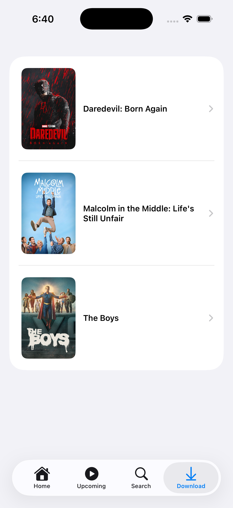
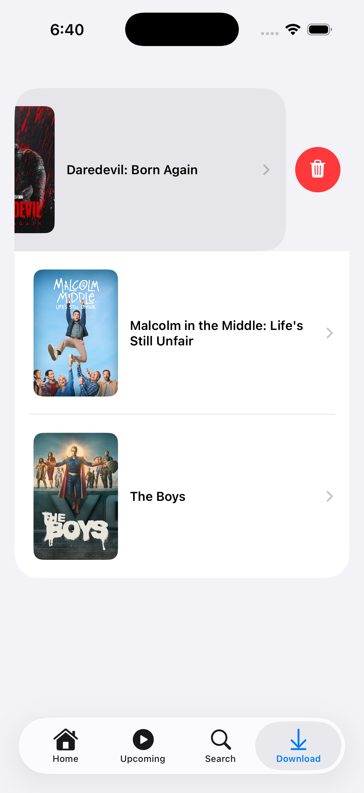

App Name: 
Pandoras Box

Description: 
A smooth and intuitive Movie and TV Show database

## ScreenShots

Features: 
-Browse Trending Movies and TV Shows
-Search
-Download
-Watch Trailers 

Tech Used:
-SwiftUi
-SwiftData
-async/await
-TMDB API
-YouTube API

SetUp InstructionsL: 
To properly load the nessesary API data to run this application, please add your own APIConfig.json file using the preloaded APIConfig.example.json template. You will need an existing API key for both themoviedb.org and YouTube. 

